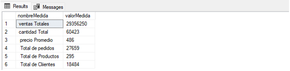

## Proyecto SQL EDA -  Exploratory Data Analysis con SQL
🧠 Descripción general
Este proyecto realiza un Análisis Exploratorio de Datos (EDA) 
sobre la base de datos DataAnalytics, un conjunto de datos relacional 
para el análisis de ventas, clientes, productos y operaciones comerciales.
El objetivo del EDA es comprender la estructura de los datos, evaluar 
su calidad y explorar patrones relevantes mediante consultas SQL. 
Se aplican técnicas como:

# Agregaciones y cálculos de métricas

- Joins entre tablas
- Análisis temporal
- Identificación de KPIs (Indicadores Clave de Desempeño)
- Ranking y segmentación de clientes y productos


🔍 SQL queries
  ```sql 
  use DataAnalytics
 ```

 -- Explorar todos las tablas en la base de datos
```sql
Select * From INFORMATION_SCHEMA.TABLES

-- Explorar todos las columnas en la base de datos

Select * From INFORMATION_SCHEMA.COLUMNS
Where TABLE_NAME = 'customers'

-- Explorar todos los paises de donde provienen los clientes

Select Distinct country from gold.customers


-- Seleccionar todas las categorias de productos

Select Distinct category from gold.products

-- Seleccionar todas las subCategorias de productos

Select Distinct category ,subcategory, product_name from gold.products
Order By 1,2,3

-- Explorar las columnas de fecha
-- Encontrar las fechas del 1er y ultimo pedido

Select 
MIN(order_date) as primerPedido , MAX(order_date) as ultimoPedido  
From gold.sales

-- Cuantos años de ventas hay disponibles

Select 
MIN(order_date) as primerPedido ,
MAX(order_date) as ultimoPedido ,
DATEDIFF(YEAR,MIN(order_date), MAX(order_date) ) as rangoPedidosenAnios,
DATEDIFF(MONTH,MIN(order_date), MAX(order_date) ) as rangoPedidosenMeses
From gold.sales


-- Encontra al cliente mas joven y al mas viejo

Select 
DATEDIFF(YEAR,MIN(birthdate),GETDATE() ) as EdadViejo,
DATEDIFF(YEAR,MAX(birthdate),GETDATE() ) as EdadJoven
From gold.customers

-- ***  Exploracion de las medidas *******
-- Encontrar las ventas Totales

Select 
SUM(price) as ventasTotales
From gold.sales

-- Encontrar cuantos articulos se venden
Select 
SUM(quantity) as cantidadTotal
From gold.sales

-- Encontrar el precio de venta promedio
Select 
AVG(price) as precioPromedio
From gold.sales


-- Encontrar el total de pedidos

Select
COUNT(order_number) as totalPedidos
From gold.sales

-- Encontrar el total de pedidos
Select
COUNT(Distinct order_number) as totalPedidos
From gold.sales

-- Encontrar el total de numeros de productos

Select COUNT(product_id) as totalProductos  from gold.products
Select COUNT(Distinct product_id) as totalProductos  from gold.products

-- Encontrar el total de numeros de clientes

Select COUNT(Distinct customer_id) as totalClientes  from gold.customers

-- Encontrar numero total de clientes que han realizado un pedido

Select COUNT(Distinct customer_key) as totalClientes  from gold.customers
Select COUNT(Distinct customer_key) as totalClientes  from gold.sales

-- *****  Generar un Reporte que muestren todas las metricas de negocio

Select 'ventas Totales' as nombreMedida , SUM(sales_amount) as valorMedida  from gold.sales
Union All
Select 'cantidad Total' as nombreMedida , SUM(quantity) as valorMedida  from gold.sales
Union All
Select ' precio Promedio' as nombreMedida , AVG(price) as valorMedida  from gold.sales
Union All
Select ' Total de pedidos' as nombreMedida , COUNT(Distinct order_number) as valorMedida  from gold.sales
Union All
Select ' Total de Productos' as nombreMedida , COUNT(Distinct product_key) as valorMedida  from gold.products
Union All
Select ' Total de Cliientes' as nombreMedida , COUNT(Distinct customer_key) as valorMedida  from gold.customers
```

-- **************************************************************************************
```sql
-- Encontrar el total de clientes por pais
Select country,
	COUNT(customer_key) totalCliente
From gold.customers
Group By country
Order By totalCliente desc

-- Encontrar el total de cliente por genero

Select gender,
	COUNT(customer_key) totalCliente
From gold.customers
Group By gender
Order By totalCliente desc

-- Encontrar el total de productos por categoria

Select category  ,
	COUNT(product_key) totalProductos
From gold.products
Group By category
Order By totalProductos desc

-- cual es el costo medio en cada categoria 

Select category  ,
	AVG(cost) costoMedio
From gold.products
Group By category
Order By costoMedio desc

-- cual es el ingreso total generado en cada categoria 

Select
p.category,
SUM(s.sales_amount) as totalIngreso
From gold.sales as s
Left Join gold.products as p ON s.product_key = p.product_key
Group By p.category
Order By totalIngreso desc

-- cual es el ingreso total generado en cada cliente

Select
c.customer_key ,
c.first_name,
c.last_name ,
SUM(sales_amount) as totalIngreso
From gold.sales as s
Left Join gold.customers as c ON s.customer_key = c.customer_key
Group By c.customer_key, c.first_name, c.last_name
Order By totalIngreso desc

-- Cual es la distribucion de los articulos vendidos en los diferentes paises

Select c.country,
COUNT(s.quantity) as TotalVendidos
from gold.sales as s
Left Join gold.customers as c ON s.customer_key = c.customer_key
Group By c.country
Order By TotalVendidos desc


-- ***  Analisis de Ranking

-- Cuales son los 5 productos que generan mayores ingresos

Select Top 5  p.product_name,
	SUM(s.sales_amount) as totalIngresos
From gold.sales as s
Left Join gold.products as p ON s.product_key = p.product_key
Group By p.product_name
Order By totalIngresos desc

-- Cuales son los 5 productos que generan mayores ingresos
 -- con Windows Functions  
 Select * 
 From (

Select p.product_name,
	SUM(s.sales_amount) as totalIngresos,
	ROW_NUMBER() Over(Order By SUM(s.sales_amount) desc) as Rank_productos
From gold.sales as s
Left Join gold.products as p ON s.product_key = p.product_key
Group By p.product_name
) t
Where Rank_productos <= 5

-- Cuales son los 5 productos que generan menor ingresos

Select Top 5  p.product_name,
	SUM(s.sales_amount) as totalIngresos
From gold.sales as s
Left Join gold.products as p ON s.product_key = p.product_key
Group By p.product_name
Order By totalIngresos 


-- Encontrar el top 10 de clientes que generaron mayor ingreso

Select Top 10
c.customer_key ,
c.first_name,
c.last_name ,
SUM(sales_amount) as totalIngreso
From gold.sales as s
Left Join gold.customers as c ON s.customer_key = c.customer_key
Group By c.customer_key, c.first_name, c.last_name
Order By totalIngreso desc


-- Encontrar el top 3 de clientes que generaron menos pedidos realizados

Select Top 3
c.customer_key ,
c.first_name,
c.last_name ,
COUNT(Distinct s.order_number) as totalPedidos
From gold.sales as s
Left Join gold.customers as c ON s.customer_key = c.customer_key
Group By c.customer_key, c.first_name, c.last_name
Order By totalPedidos

```
